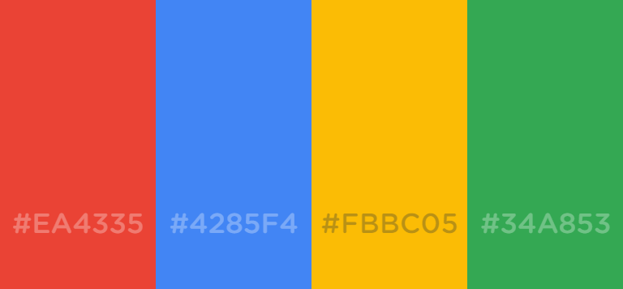

<p align=center></p>

<h3 align=center>Google for Data Science, AI, Data Analytics and Marketing</h3>

```html
Blue    #4285F4
```

```
Red     #EA4335 
```

```
Yellow  #FBBC05
```

```
Green   #34A853
```

<table align=center width=100%>
  <tr><th width = 5%><h4>Product</h4></th><th><h4>Name</h4></th><th><h4>Description</h4></th></tr>
  <tr><td><a href="https://ai.google/" target="_blank"></a></td><td><h5>Google AI</h5></td><td><h5>A division of Google dedicated to Artificial Intelligence.</h5></td></tr>
  <tr><td><a href="https://marketingplatform.google.com/about/" target="_blank"></a></td><td><h5>Google Marketing Platform</h5></td><td><h5>A unified advertising and analytics platform for smarter marketing and better analytics.</h5></td></tr>
  <tr><td><a href="https://marketingplatform.google.com/about/analytics/" target="_blank"></a></td><td><h5>Google Analytics</h5></td><td><h5>A tool to analyze data for your business in one place.</h5></td></tr>
  <tr><td colspan=3 align=center></td></tr>
</table>
